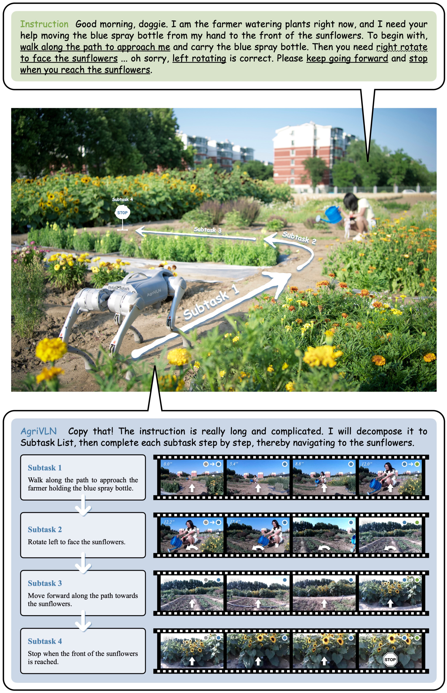
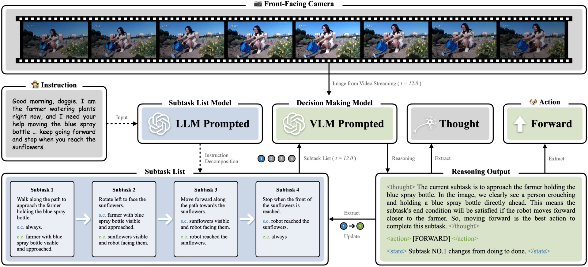

<div align="center">
<h1>AgriVLN: Vision-and-Language Navigation for Agricultural Robots</h1>

[Xiaobei Zhao](https://orcid.org/0009-0005-3123-5536) · Xingqi Lyu · [Xin Chen](https://faculty.cau.edu.cn/cx/)<sup>✉️</sup> · [Xiang Li](https://faculty.cau.edu.cn/lx_7543/)<sup>✉️</sup>

**[China Agricultural University](https://ciee.cau.edu.cn)**

xiaobeizhao2002@163.com, lxq99725@163.com, chxin@cau.edu.cn, cqlixiang@cau.edu.cn

<p>
  <a href="https://arxiv.org/abs/2508.07406"></a>
  <a href="LICENSE"></a>
</p>


</div>

## Updates
- [June 12th, 2026] The codes of the AgriVLN method are available in this repository.
- [August 10th, 2025] The paper “AgriVLN: Vision-and-Language Navigation for Agricultural Robots” is available for reading on [arXiv](https://arxiv.org/abs/2508.07406).

## Overview
Agricultural robots are serving as powerful members across a wide range of agricultural tasks, nevertheless, still heavily relying on manual operations or railway systems for movement. Vision-and-Language Navigation (VLN) enables robots to navigate to the target destinations following natural language instructions, demonstrating strong performance on several domains. However, none of the existing benchmarks or methods is specifically designed for agricultural scenes. 

To bridge this gap, we propose the A2A benchmark, containing 1,560 episodes across six diverse agricultural scenes, in which all realistic RGB videos are captured by the front-facing camera on a quadruped robot at a height of 0.38 meters, aligning with the practical deployment conditions. Meanwhile, we propose the AgriVLN method based on Vision-Language Model (VLM) prompted with carefully crafted templates, which can understand both given instructions and agricultural environments to generate appropriate low-level actions for robot control. When evaluated on A2A, AgriVLN performs well on short instructions but struggles with long instructions, because it often fails to track which part of the instruction is currently being executed. To address this, we further propose the STL module decomposing an instruction into a sequence of subtasks, to guide the decision-maker attending to the current active subtask. When integrated with STL, AgriVLN effectively improves on Success Rate (SR) from 0.33 to 0.47. We additionally compare AgriVLN with several existing methods, demonstrating the state-of-the-art performance in the agricultural VLN domain.



## Quick Start
1. Download the codes of the AgriVLN.
```bash
git clone git@github.com:AlexTraveling/AgriVLN.git
cd AgriVLN-main
```

2. Create a new conda environment, then install all the dependent packages.
```bash
conda create -n agrivln python=3.11
conda activate agrivln
pip install -r requirements.txt
```

3. Deploy the ollama environment following the [official guidance](https://github.com/ollama/ollama), then download the Large Language Model (LLM) and Vision-Language Model (VLM), for which we use DeepSeek-R1-32B and Qwen2.5-VL-32B as the default LLM and VLM, respectively.
```bash
# (optional) if you are in China, the download speed may be very slow. to solve this issue, you may try the following code.
source /etc/network_turbo

# download ollama
curl -fsSL https://ollama.com/install.sh | sh

# pull LLM and VLM
ollama pull deepseek-r1:32b
ollama pull qwen2.5vl:32b
```

4. Run the homepage file to start the AgriVLN method.
```bash
python home_agrivln.py
```

5. The running results will be saved in the `/AgriVLN/runs` path.

## Acknowledgment
This work is supported by the Sichuan Chengdu Modern Agricultural Industry Research Institute of China Agricultural University: Provincial and Municipal Agricultural Subsidy Funded Project; the Natural Science Foundation of Sichuan Province (2024NSFSC0389); and the Provincial and Municipal Agricultural Subsidy Special Funds for the Construction of CAU–SCCD Advanced Agricultural \& Industrial Institute. Thanks to Tbilisi, Baku and Kunming for the impressive traveling experiences, giving us a chilled vibe for experiment and writing. Thanks to Yuanquan Xu, the inspiration to us.

## Citation
If our paper or method is helpful for your research, welcome you use the following citation:
```bibtex
@inproceedings{AgriVLN,
  title={AgriVLN: Vision-and-Language Navigation for Agricultural Robots},
  author={Xiaobei Zhao and Xingqi Lyu and Xin Chen and Xiang Li},
  booktitle={arXiv:2508.07406},
  year={2025}
}
```

## Communication
If you have any issues with our study, welcome you contact the first author (Xiaobei Zhao, xiaobeizhao2002@163.com) to share your findings and thoughts with us.